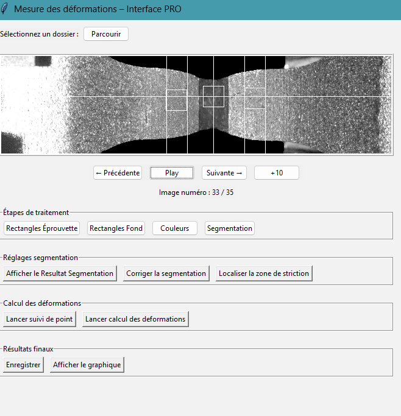

[](https://www.python.org/)
[](https://www.opencv.org/)
[](https://docs.python.org/3.13/library/tkinter.html)

# Automatic Measurement of Specimen Deformation \n (classic image processing version)

> 🔬 Python tool for measuring the deformation of tensile specimens from images, developed during an internship at Thiot Ingénierie (France).
> 


## 🧠 Description

This tool automates the measurement of deformation in tensile test specimens using image processing techniques.

- 📷 Input: images from physical test benches (classic tensile tests)
- 🧪 Output: quantitative deformation values
- 🖥️ GUI: simple interface with Tkinter
- 📊 Comparison: results evaluated against industrial software VIC-2D

---

## 🇫🇷 Description en français

Outil Python de mesure automatique de la déformation d’éprouvettes de traction, développé durant un stage chez Thiot Ingénierie.

- 📷 Entrée : images issues d’essais mécaniques sur bancs de traction
- 🧪 Sortie : valeurs quantitatives de déformation
- 🖥️ Interface : interface utilisateur simple (Tkinter)
- 📊 Comparaison : comparé au logiciel VIC-2D (écart moyen de 10%)

---

## 🗂️ Structure du projet
```
automatic_measurement
│   README.md
│   run_app.py
│   requirements.txt
│
├───utils
│   │   correlation.py
│   │   segmentation.py
│   │   maths_utils.py
│   │   miscelanous_image.py
│   │   setup_images.py
│   │   utils_cv2.py
│   │   lpe.py
│
└───gui
    │   app.py
```
